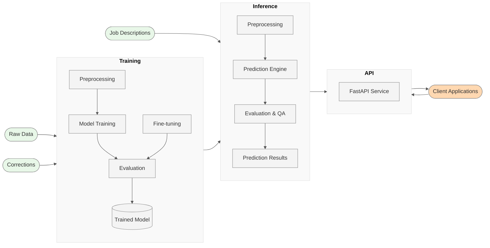
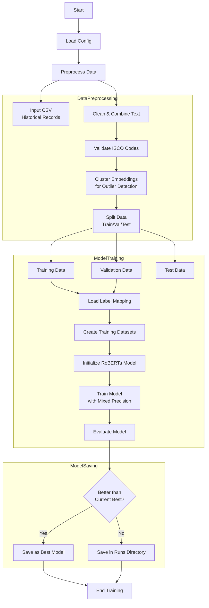
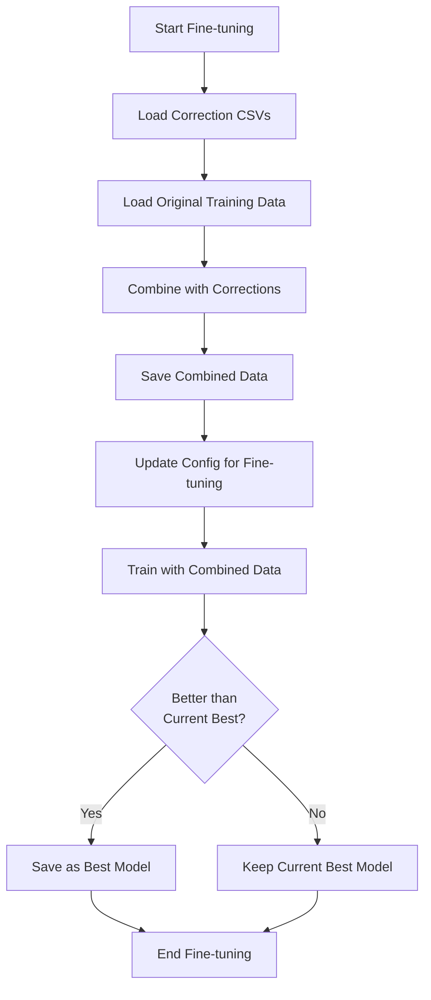
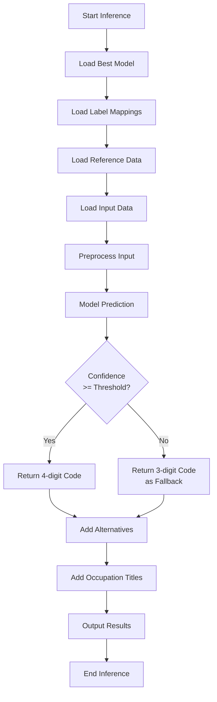
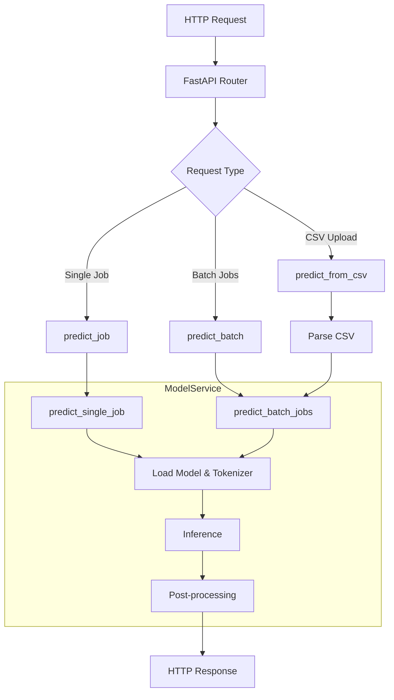

# ISCO Pipeline Diagrams

## Complete System Overview

```mermaid
%%{init: {'theme': 'base', 'themeVariables': { 'fontSize': '16px', 'fontFamily': 'arial', 'primaryColor': '#f4f4f4', 'primaryTextColor': '#333', 'primaryBorderColor': '#888', 'lineColor': '#555', 'secondaryColor': '#eaf4ff', 'tertiaryColor': '#f9f9f9' }}}%%
flowchart LR
    %% Data sources
    Raw([Raw Data]) --> Training
    Corrections([Corrections]) --> Training
    JobDesc([Job Descriptions]) --> Inference
    
    %% Main components flow left to right
    subgraph Training
        direction TB
        Preprocess[Preprocessing]
        TP[Model Training]
        Eval[Evaluation]
        FT[Fine-tuning]
        Model[(Trained Model)]
        
        %% Internal connections top to bottom
        Preprocess --> TP
        TP --> Eval
        FT --> Eval
        Eval --> Model
    end
    
    Training --> Inference
    
    subgraph Inference
        direction TB
        InferPreproc[Preprocessing]
        Predict[Prediction Engine]
        InferEval[Evaluation & QA]
        Results[Prediction Results]
        
        %% Internal connections top to bottom
        InferPreproc --> Predict
        Predict --> InferEval
        InferEval --> Results
    end
    
    Inference --> API
    
    subgraph API
        direction TB
        FastAPI[FastAPI Service]
    end
    
    %% External users
    Client([Client Applications]) --> API
    API --> Client

    classDef default fontSize:14px;
    classDef big fontSize:16px,font-weight:bold;
    classDef input fontSize:14px,fill:#e8f7e8;
    classDef output fontSize:14px,fill:#ffd8b1;

    class Training,Inference,API big;
    class Raw,Corrections,JobDesc input;
    class Client output;
```

## Training Pipeline

```mermaid
flowchart TD
    A[Start] --> B[Load Config]
    B --> C[Preprocess Data]
    C --> D[Input CSV\nHistorical Records]
    C --> E[Clean & Combine Text]
    E --> F[Validate ISCO Codes]
    F --> G[Cluster Embeddings\nfor Outlier Detection]
    G --> H[Split Data\nTrain/Val/Test]
    H --> I[Training Data]
    H --> J[Validation Data]
    H --> K[Test Data]
    
    I --> L[Load Label Mapping]
    J --> L
    L --> M[Create Training Datasets]
    M --> N[Initialize RoBERTa Model]
    N --> O[Train Model\nwith Mixed Precision]
    O --> P[Evaluate Model]
    P --> Q{Better than\nCurrent Best?}
    Q -- Yes --> R[Save as Best Model]
    Q -- No --> S[Save in Runs Directory]
    R --> T[End Training]
    S --> T

    subgraph DataPreprocessing
        D
        E
        F
        G
        H
    end

    subgraph ModelTraining
        I
        J
        K
        L
        M
        N
        O
        P
    end

    subgraph ModelSaving
        Q
        R
        S
    end
```

## Fine-tuning Pipeline

```mermaid
flowchart TD
    A[Start Fine-tuning] --> B[Load Correction CSVs]
    B --> C[Load Original Training Data]
    C --> D[Combine with Corrections]
    D --> E[Save Combined Data]
    E --> F[Update Config for Fine-tuning]
    F --> G[Train with Combined Data]
    G --> H{Better than\nCurrent Best?}
    H -- Yes --> I[Save as Best Model]
    H -- No --> J[Keep Current Best Model]
    I --> K[End Fine-tuning]
    J --> K
```

## Inference Pipeline

```mermaid
flowchart TD
    A[Start Inference] --> B[Load Best Model]
    B --> C[Load Label Mappings]
    C --> D[Load Reference Data]
    D --> E[Load Input Data]
    E --> F[Preprocess Input]
    F --> G[Model Prediction]
    G --> H{Confidence\n>= Threshold?}
    H -- Yes --> I[Return 4-digit Code]
    H -- No --> J[Return 3-digit Code\nas Fallback]
    I --> K[Add Alternatives]
    J --> K
    K --> L[Add Occupation Titles]
    L --> M[Output Results]
    M --> N[End Inference]
```

## API Data Flow

```mermaid
flowchart TD
    A[HTTP Request] --> B[FastAPI Router]
    B --> C{Request Type}
    C -- Single Job --> D[predict_job]
    C -- Batch Jobs --> E[predict_batch]
    C -- CSV Upload --> F[predict_from_csv]
    
    D --> G[predict_single_job]
    E --> H[predict_batch_jobs]
    F --> I[Parse CSV]
    I --> H
    
    subgraph ModelService
        G --> J[Load Model & Tokenizer]
        H --> J
        J --> K[Inference]
        K --> L[Post-processing]
    end
    
    L --> M[HTTP Response]
```